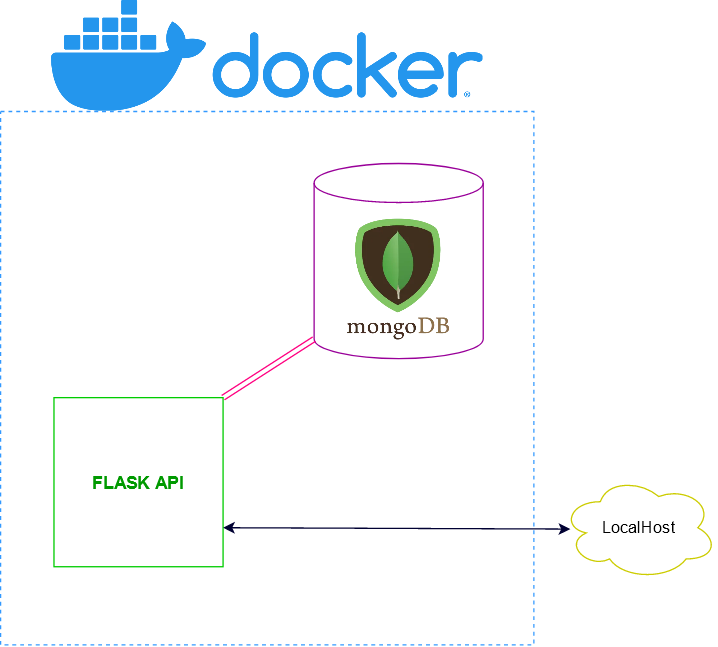

<h2> Présentation </h2>

Voici une petite api accompagnent le projet de reconnaissance par EEG de l'endormissement au volant.
Cet api vous permet de predire la mise en danger du conducteur sur une base de 17 électrodes a partir d'une sequence Raw_data d'EEG


<h2> Installation </h2>

1. Pré-requis :
	- git 
	- docker/docker-compose 

	```
	git clone https://github.com/AurelPuj/EEG_Drowsiness_Driver.git
	```


2. Lancement du docker-compose :

	```bash
	cd EEG_Drowsiness_Driver/api/ 
	docker-compose up 
	```
				
3. Connexion a la base de donnée :

	- ouvrir un nouveau terminal 
	- créer un nouveau user :

	```bash 
	docker exec -it mongodb bash
	mongo -u mongodbuser -p
	use flaskdb
	db.createUser({user: 'flaskuser', pwd: '1234', roles: [{role: 'readWrite', db: 'flaskdb'}]})
	```

	- se log sur la base de donnée :

	``` bash 
	exit
	mongo -u flaskuser -p your password --authenticationDatabase flaskdb
	exit
	exit
	```
   
    
<h2> Utilisation </h2>

1. Test de l'installation :

	```bash
	curl -i http://0.0.0.0:5000/
	``` 
	Cette fonction devrait vous afficher un message de bienvenue.

2. Modèle stocker dans la database mongodb :

	```bash
	curl -i http://0.0.0.0:5000/model
	``` 

	Cette requête vous retourne la liste de tout les modèles actuellement stockés dans la database mongodb.
  
3. Prédiction :

	En utilisant l'application POSTMAN on envoie la requête POST : http://0.0.0.0:5000/predict avec comme body au format JSON des données avec lesquelles le modèle doit prédire un poucentage de somnolence compris entre 1 et 0. Electrodes utilisées : FT7, FT8, T7, T8, TP7, TP8, CP1, CP2, P1, PZ, P2, PO3, POZ, PO4, O1, OZ, O2. Concernant le format du JSON envoyé il faut qu'il est pour chaque électrodes et pour chaque ondes (Alpha, Beta, Delta, Thêta, Gamma)  Le PSD (power spectral density) avec une moving average puis avec un linear dynamic system suivi de la DE (differential entropy) encore une fois avec une moving average et un linear dynamic system. Par exemple, pour le FT7, on aura les colonnes : FT7_delta_psd_movingAve, FT7_theta_psd_movingAve, FT7_alpha_psd_movingAve, FT7_beta_psd_movingAve, FT7_gamma_psd_movingAve, FT8_delta_psd_movingAve, ... et ainsi de suite pour chaque composantes (psd_movingAve, psd_LDS, de_movingAve, de_LDS)

<h2> Technologie de l'API </h2>

<h4> Principe et shématisation </h4> 
	L'utilisateur envoie un fichier contenant les Raw data D'EEG et specifie le modéle à utiliser ( ex: LinearRegression , CNN , Treeboosting ...)
	L'API reçoi le fichier et l'instruction du modèle puis en fonction du modèle choisi, l'api vas chercher les poids du modèle dans la base de donnée.
	Ensuite l'API renvoi les donnée predite dans un fichier json a l'utilisateur.


	


<h3>Flask API </h3> 

	Flask est un framework Web en croissance rapide, conçu pour un processus de conception d'API plus efficace. Eh bien, ce n’est que l’un des usages possibles de Flask.
	Flash est léger est très bien documenté. Il exite aussi d'autre framework comme Fast API qui posssede les même avantages que Flask mais nos connaissances, préalable sur Flask API nous ont permis de gagner en efficacité sur la mise en place. 

<h3>Mongo DB </h3>

	MongoDB est un système de base de donnée orienté objet, dynamique, stable, scalable et sans SQL.
	MongoDB execelle dans stockage de document et pour tout objet non lier entre eux hors les poids des modèles sont stockeé dans des fichiers et son totalement independant des autres poids.
	Deplus MongoDB effectue très les mise a jour de ses objets ce qui vas arriver frequement dans notre cas. 
	Il existe d'autre technologie comme cassandraDB ou postgre mais toute deux moins perfomantes dans la gestion d'objet que mongoDB 

<h3>Docker  </h3>

	La technologie Docker nous permet de contenairiser notre API , et de réaliser le liens entre MongoDB et Flask API.
	Nous avons choisis aussi Docker car elle permet une facilité de portabilité de notre API et son installation.
	Nous n'avons pas pris les alternatives comme Cononical LXD ou  Kubernetes car nous misons sur nos conaissances préalable de Docker pour un resultat plus rapide.

