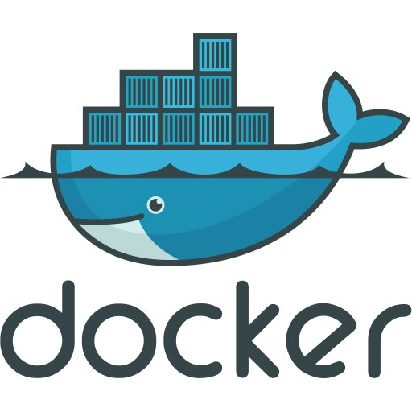

<h2> Presentation </h2>
Voici une petite api accompagnant le projet de reconnaissance par EEG de l'endormissement au volant.
Cet api vous permet de predire la mise en danger du conducteur sur une base de 17 électrodes. 


<h2> Installation </h2>
 1.pré-requis :
 
  - git 
  - docker/docker-compose 
  
```
git clone https://github.com/AurelPuj/EEG_Drowsiness_Driver.git
```


2.lancement du docker-compose :
```bash
cd EEG_Drowsiness_Driver/api/ 
docker-compose up 
```
3.connexion a la base de donnée :

   - ouvrir un nouveau terminal 
   - créer un nouveau user :
   ```bash 
   docker exec -it mongodb bash
   mongo -u mongodbuser -p
   use flaskdb
   db.createUser({user: 'flaskuser', pwd: '1234', roles: [{role: 'readWrite', db: 'flaskdb'}]})
   ```
   - se log sur la base de donnée :
   ``` bash 
   exit
   mongo -u flaskuser -p your password --authenticationDatabase flaskdb
   exit
   exit
   ```
   
    
<h2> Utilisation </h2>

1. Test de l'installation 
  ```bash
  curl -i http://0.0.0.0:5000/version
  ``` 

<h2> Technologie de l'API </h2>

<h4> Principe et shématisation </h4> 

<h3>Flask API        </h3>  


<h3>Mongo DB </h3>

<h3>Docker  </h3>
